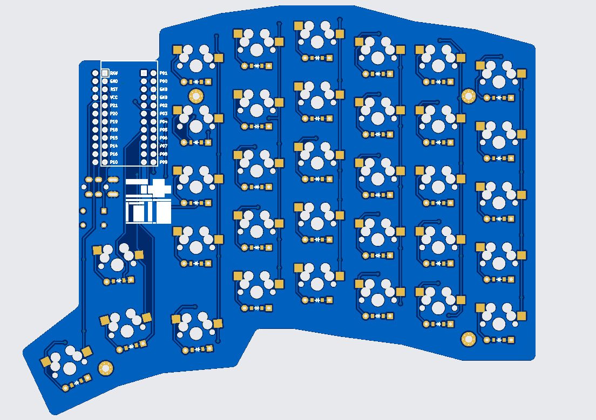

# Nescius66

## 画像ギャラリー



```bash
ergogen . && for i in output/cases/*.jscad; do npx @jscad/cli@1 "$i" -of stla; done
```

## Use external parts

add footprint to **/footprints** folder. then run command below

```bash
ergogen .
```
